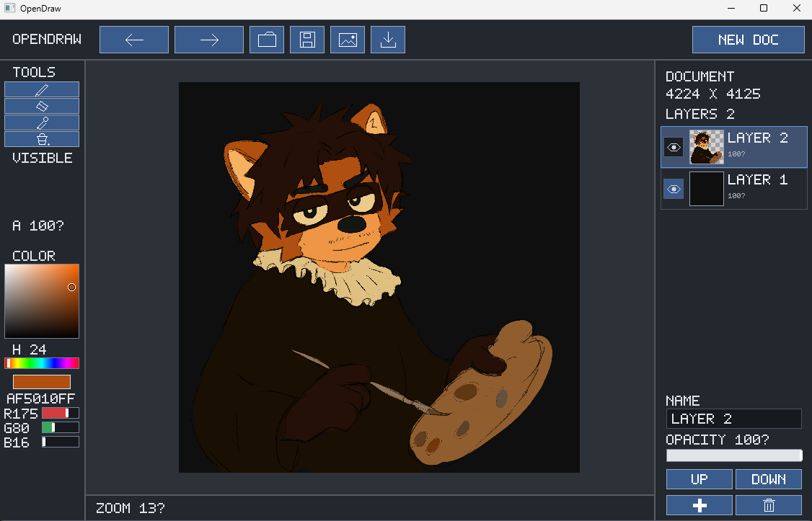

# OpenDraw

Un editor de dibujo raster para Windows, hecho desde cero en Rust y sin dependencias externas.



## Características

- Pincel y borrador con bordes suavizados, grosor y opacidad; cuentagotas y relleno.
- Tamaños de lienzo preestablecidos y fondo personalizable en una capa separada.
- Capas reordenables con nombre, visibilidad, opacidad y miniaturas.
- Selector de color HSV, RGB y vista del valor hexadecimal.
- Historial de deshacer y rehacer para pintura y capas.
- Documentos `.odraw`, importación PNG y exportación PNG/BMP.
- Zoom con la rueda y desplazamiento del lienzo con el botón central.
- Entrada de lápiz mediante Windows Pointer Input, con presión para grosor y opacidad, cursor en proximidad y goma física temporal.

## Ejecutar

Necesitas Windows y una instalación reciente de Rust:

```powershell
cargo run
```

Para generar un ejecutable de Windows x64 con el runtime de C integrado,
desde una instalación de Rust `x86_64-pc-windows-msvc`:

```powershell
cargo rustc --release --locked -- -C target-feature=+crt-static
```

El resultado es `target/release/opendraw.exe`. No necesita Rust ni una
instalación adicional del runtime de Visual C++ en el equipo de destino.
Las novedades y el estado de la primera versión están en
[RELEASE_NOTES.md](RELEASE_NOTES.md).

Al crear un documento puedes elegir un tamaño preestablecido o introducir las
dimensiones en píxeles. Están disponibles Cuadrado, SVGA, XGA, WXGA+, SXGA,
WSXGA+, UXGA, FHD, WUXGA, 4K, Postal y Sticker. **Postal** corresponde a
100 × 148 mm a 300 PPP, convertido a **1181 × 1748 píxeles**.

El fondo es blanco por defecto. Puedes elegir otro color con el mismo selector
HSV/RGB del editor, o seleccionar transparencia. El documento se crea con dos
capas: **BACKGROUND** debajo y **LAYER 2**, transparente y activa, encima. Al
borrar en la capa de dibujo aparece el fondo elegido. Las dos capas siguen
siendo editables desde el panel de capas y se conservan en el archivo `.odraw`.

En ventanas pequeñas, desplaza el formulario con la rueda del ratón; `Tab`
también lleva cada control a la vista.

## Atajos

| Acción | Atajo |
| --- | --- |
| Deshacer / rehacer | `Ctrl+Z` / `Ctrl+Y` |
| Abrir / guardar | `Ctrl+O` / `Ctrl+S` |
| Importar PNG | `Ctrl+I` |
| Exportar imagen | `Ctrl+E` |
| Diagnóstico de tableta | `F12` |

El formato `.odraw` conserva las dimensiones del documento y todas sus capas, incluyendo nombres, visibilidad, opacidad y píxeles. Al exportar, PNG mantiene la transparencia y BMP aplana la imagen sobre fondo blanco.

## Tabletas y presión

El pincel y el borrador usan la presión para variar el tamaño y la opacidad durante el trazo. El tamaño mínimo corresponde al 10% del diámetro seleccionado, con un mínimo de un píxel. El ratón utiliza el mismo motor con presión constante al 100%. Las muestras de movimiento se interpolan en orden cronológico y conservan el espaciado entre eventos.

Los bordes circulares se suavizan en los píxeles de la capa, conservando posiciones y tamaños fraccionarios. El suavizado se mantiene al deshacer, guardar y exportar. El zoom sigue mostrando los píxeles directamente: a mucho aumento se verá su estructura raster.

Para probar una Wacom, activa **Usar Windows Ink** en el perfil de OpenDraw del controlador. Wacom documenta la [configuración de Windows Ink por aplicación](https://support.wacom.com/hc/en-us/articles/1500006328562-A-virtual-keyboard-opens-every-time-I-use-my-pen-in-Windows-why). Ejecuta `cargo run`, crea un documento y pulsa `F12` para ver presión, contacto, inclinación, botones y muestras recibidas.

- Mueve el lápiz sin tocar: debe aparecer el cursor sin pintar.
- Traza una línea aumentando la presión: deben variar grosor y opacidad.
- Levanta el lápiz y vuelve a apoyarlo: los trazos deben quedar separados. `Ctrl+Z` debe deshacer un trazo completo.
- Si tu lápiz tiene goma, úsala y vuelve a la punta: la herramienta seleccionada debe conservarse.
- Prueba los botones y deslizadores de la interfaz con el lápiz, además del ratón.
- Comprueba la posición con zoom y desplazamiento del lienzo, y con el escalado de pantalla que uses. Cambia de ventana durante un contacto y verifica que el trazo termina.

La validación automática cubre el motor y paquetes generados con los tipos nativos del SDK de Windows, con pruebas de tamaño, alineamiento y posición de los campos en memoria. Los detalles están en [tests/fixtures](tests/fixtures/README.md). El dibujo con presión se ha comprobado con una Wacom física. El ajuste de curva de presión, la asignación de acciones a botones y el backend Wintab siguen pendientes. La inclinación se muestra en el diagnóstico y se conserva en las muestras, pero todavía no modifica la forma del pincel.

## Estado

OpenDraw está en desarrollo y actualmente funciona en Windows.

El suavizado de bordes del pincel y del borrador está implementado. Las decisiones,
pruebas y mediciones están en [antialiasing.md](antialiasing.md). Queda por confirmar
el resultado de esta mejora con la Wacom física.

## Licencia

[MIT](LICENSE)
